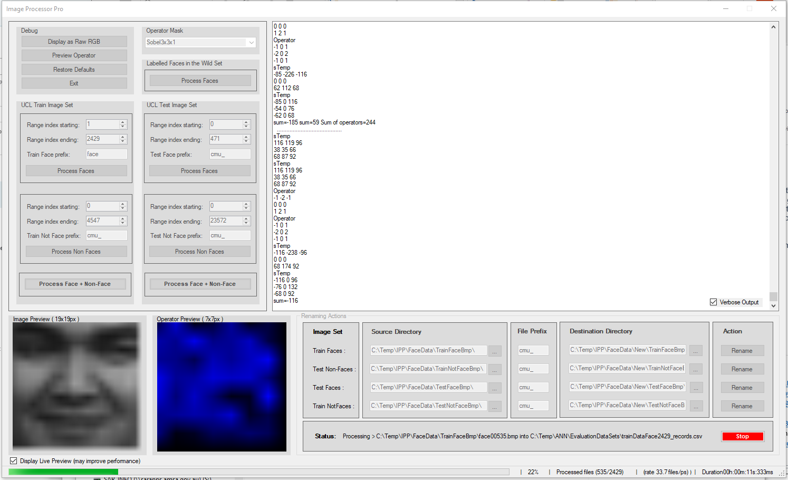

# image-processor
An image processor written in C#. Applies math operators on a given image set. Results in a set of data parameters to use for neural network training.

I developed this at university to transform greyscale image datasets of 19x19 pixels to a 7x7 image using a set of mathematical operators (Sobel, Kirsch, Prewitt, Scharr and Isotropic).

The image is downscaled by moving a 3x3 operator along the given bitmap, multiplies against it, sums up the 9 values and returns that as a single paramter for a NN to train with. It then continues to move along the image until all pixels have been transformed.

## Dataset Output
Each transformed face is represented as a single 50 column row in the output CSV file. The 50th column specifies the class (0 non-face, 1 face).

## Features
* gui interface
* live preview window (cool effect)
* multiple types of math operators
* multi-threaded
* displays image processing rate
* shows a realtime progress bar
* shows the time elapsed and total processing duration

## Screenshot

## License
For all files in this repository that don't contain explicit licensing, the MIT license then applies. See the accompanying LICENSE for more details.